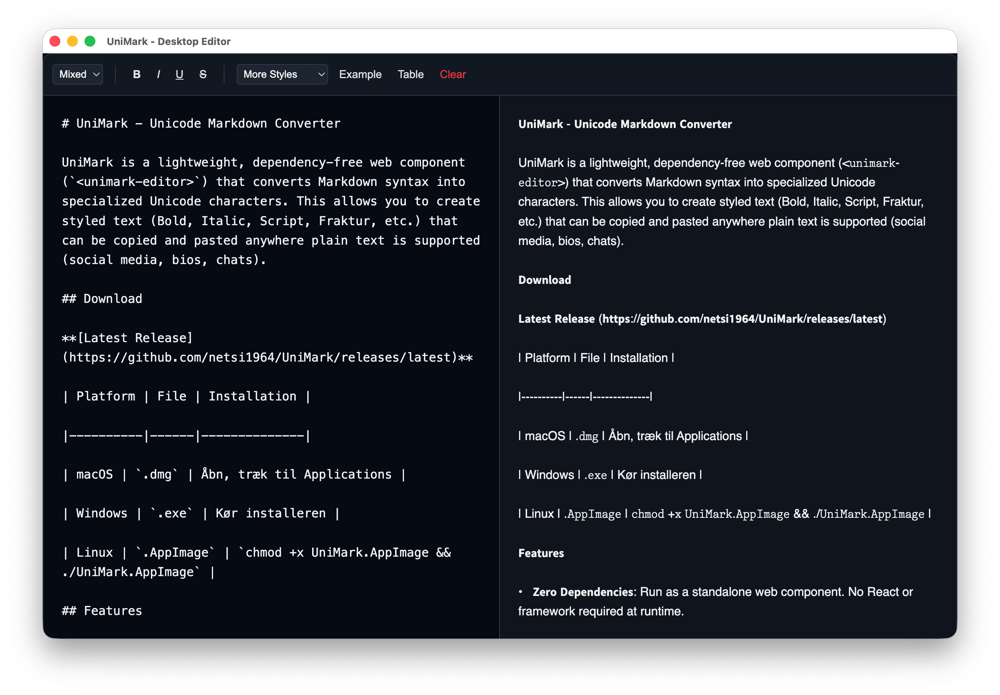

# UniMark - Unicode Markdown Converter

UniMark is a lightweight, dependency-free web component (`<unimark-editor>`) that converts Markdown syntax into specialized Unicode characters. This allows you to create styled text (Bold, Italic, Script, Fraktur, etc.) that can be copied and pasted anywhere plain text is supported (social media, bios, chats).



<div style="width: 100vw;display: flex; justify-content: center;">
<a href="https://www.buymeacoffee.com/netsi1964" target="_blank"></a>
</div>

## Download

🎉 **UniMark is now available as a desktop app!** Download and run directly on your computer – no browser required.

**[Latest Release](https://github.com/netsi1964/UniMark/releases/latest)**

We offer **two different versions** of the Desktop app, depending on your needs.

### 1. Neutralino.js Version (Ultra-Lightweight • Highly Recommended)
This version brilliantly uses your operating system's built-in web viewer (WKWebView, WebView2, WebKitGTK). It delivers an **extremely small size (under 5 MB!)** with close-to-zero extra RAM usage.

| Platform | File | Installation |
|----------|------|--------------|
| macOS | `UniMark-Neutralino-macOS.zip` | Unzip the app. See the **macOS Installation Guide** below for one-time setup. |
| Windows | `UniMark-Neutralino-Win64.exe` | Run the application |
| Linux | `UniMark-Neutralino-Linux64` | `chmod +x` and run |

#### 🍏 macOS Installation Guide (Important!)
Because UniMark is a free Open-Source project, it does not use a paid Apple Developer Certificate ($99/year). As a result, macOS's security feature ("Gatekeeper") automatically places the downloaded app in "Quarantine" to protect you from unknown software, which prevents it from running.

You only need to remove this quarantine **once** using a simple Terminal command:

1. **Unzip** the downloaded `UniMark-Neutralino-macOS.zip` file so you see the `UniMark-Neutralino-macOS.app`.
2. Open the **Terminal** app on your Mac (you can find it via Spotlight Search: `Cmd + Space` -> "Terminal").
3. Type the following command, ending with a single space (do not press enter yet):
   ```bash
   xattr -cr 
   ```
4. **Drag and drop** the `UniMark-Neutralino-macOS.app` from Finder directly into the Terminal window. This will automatically paste the correct file path.
5. Press **Enter**. (It won't show any success message, it just goes to the next line).
6. You're done! You can now **double-click** the app in Finder to open it normally forever.

### 2. Electron Version (Classic)
This version includes a fully bundled Chromium browser. It offers maximum compatibility, but has a much larger file size (~160 MB).

| Platform | File | Installation |
|----------|------|--------------|
| macOS | `.dmg` | Open, drag to Applications |
| Windows | `.exe` | Run the installer |
| Linux | `.AppImage` | `chmod +x UniMark.AppImage && ./UniMark.AppImage` |

## Features

-   **Zero Dependencies**: Run as a standalone web component. No React or framework required at runtime.
-   **Live Preview**: Instant conversion as you type.
-   **Formatting Toolbar**:
    -   **Bold** (`**text**` → 𝗕𝗼𝗹𝗱)
    -   **Italic** (`*text*` → 𝘐𝘵𝘢𝘭𝘪𝘤)
    -   **Underline** (`++text++` → U̲n̲d̲e̲r̲l̲i̲n̲e̲)
    -   **Strikethrough** (`~~text~~` → S̶t̶r̶i̶k̶e̶)
-   **Advanced Styles**: Access 10+ styles via dropdown (Script, Fraktur, Double Struck, Bubble, etc.).
-   **Table Support**: Automatically aligns markdown tables with Unicode box-drawing characters.

## Installation & Setup

### Prerequisites
- Node.js (for building locally)

### Run Locally
1.  **Install dependencies**:
    ```bash
    npm install
    ```
2.  **Start development server**:
    ```bash
    npm run dev
    ```
    Open `http://localhost:3000` to see the editor.

## Distribution & Usage

UniMark is built to be portable. You can use the single JavaScript file in any HTML project.

### Build the Web Component & Demo
To generate the web distributable files:

```bash
npm run build
```

This will create a `dist/` folder containing:
-   `unimark-element.js`: The self-contained ES Module.
-   `unimark.html`: A full-screen demo page.

### Build the Desktop Apps

To build the ultra-lightweight Neutralino app locally:
```bash
npm run neutralino:build
```
Output binaries will be located in `unimark-desktop/dist/unimark/`.

To build the Electron app locally:
```bash
npm run electron:package
```
Output installers will be located in `release/`.

### Use on CodePen / Static Sites
Simply import the script as a module:

```html
<!-- Import the element -->
<script type="module" src="./unimark-element.js"></script>

<!-- Use the tag -->
<unimark-editor></unimark-editor>
```

### Use directly from GitHub (via CDN)
You can import the element directly without downloading anything:

```html
<!-- Import from GitHub via jsDelivr -->
<script type="module" src="https://cdn.jsdelivr.net/gh/netsi1964/UniMark@main/dist/unimark-element.js"></script>

<!-- Use the tag -->
<unimark-editor></unimark-editor>
```

### Full-Screen Mode
The `dist/unimark.html` file demonstrates how to run the editor in full-screen mode, ideal for hosted tools or embedded iframes.

### AI Agent Skill (Claude, Codex)
UniMark is also available as a native **AI Skill** for **Claude.ai**, **Claude Code**, and **Codex**.
See [`skill/README.md`](skill/README.md) for installation and usage instructions.

## Syntax Guide

| Style | Markdown Syntax | Result |
| :--- | :--- | :--- |
| **Bold** | `**text**` | 𝗕𝗼𝗹𝗱 |
| *Italic* | `*text*` | 𝘐𝘵𝘢𝘭𝘪𝘤 |
| <u>Underline</u> | `++text++` | U̲n̲d̲e̲r̲l̲i̲n̲e̲ |
| ~~Strike~~ | `~~text~~` | S̶t̶r̶i̶k̶e̶ |
| Script | `((SCRIPT:text))` | 𝒮𝒸𝓇𝒾𝓅𝓉 |
| Fraktur | `((FRAKTUR:text))` | 𝔉𝔯𝔞𝔠𝔱𝔲𝔯 |
| Bubble | `((BUBBLE:text))` | Ⓣⓔⓧⓣ |

*(Select styles from the "Flere Stilarter" dropdown to insert generic syntax automatically)*
